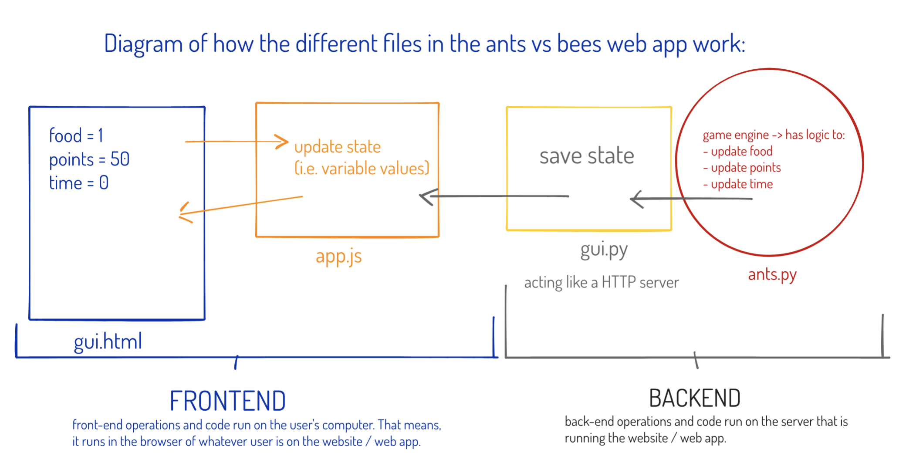

# Ants vs Bees Game 

This web-based game is an extension of the original **Ants vs Some Bees** game that is taught as a project in UC Berkeley's C88C / CS61 course; Data Structures.

Our app extends the functionality of the original game with some major changes. 

 

## Tests

To run tests on this program, we use PyTest based unit testing.

Current Tests:
- test_core_ant.py
- test_gamestate.py

### To run tests from terminal

> pytest

 

## Roadmap of Development (Extensions) 

After taking the completed game from the project description, our app implements the following steps: 

### (IN PROGRESS) 1. Version Control with Git and Github 

This is not so much shown in the code but will be reflected in how we interact with the app. 

### (IN PROGRESS) 2. Automated Testing with PyTest 

- add **tests/** directory for all test files 
- include **PyTest** in the *requirements.txt* file 
- write unit tests for core game behavior 

Tests are easily extensible and modularized. 

### (COMPLETE) 3. Continuous Integration (CI) 

We will set up **Github Actions** so that every push to the project repo automatically runs the entire folder of tests and gives a pass or fail report. 

### (COMPLETE) 4. Simple Scoring System 

- add scoring system to **GameState** class 
- add points for killing bees, subtract points for time, subtract points for bees killing ants 
- update score each turn 
- write tests to test our scoring works / changes 

### 5. Front-end Development with Flask 

Game is already Flask based but we will work on extending the functionality of Flask. 

- add form for user to pick difficulty of the game before game starts 
- change Flask routes so that there are multiple routes to go to / from 

#### Task for Aug 5, 2025: 

In an effort to better separate the logic in the game and web app componenets of this project, we are going to create a game engine file and then separately have **Flask** based server side functionality (instead of the basic HTTP code in gui.py).

**Your task:** 

- create a new file called **ants_engine.py** at the same level in the project as ants.py, gui.py, etc. 
- inside of ants_engine.py, copy over the Place, Insect, Ant, Bee, and variants of Ants and Bees classes only from ants.py 
- write a test file in tests/ that has 3 functions that do some basic tests of this new ants_engine.py file to ensure the classes are working as before (when they were in ants.py) 
- when this test works by executing it in Terminal, then delete the classes from ants.py that you just put inside of ants_engine.py 
- then, inside of ants.py, import all of the classes from ants_engine.py 
- go and run the game to ensure that it works 
- then, once it works, do the appropriate steps to stage the changes, commit them (with a descriptive message), and push to the github repo 

### 6. (Optional) Advanced Web Framework 

Generally, Flask-based web apps are usually only used for tutorials and toy examples. Flask is very lightweight and, thus, very limited in what can 
integrate with it and its functionality. Most production web apps in Python do **NOT** use Flask. 

We can swap out Flask and use a more advanced and powerful web framework, *e.g.* **FastAPI** *or* **Django** 

### 7. User Accounts and Login (SQL / Databases) 

- add user signup and login flows 
- create a **postgres** (*i.e. PostgreSQL*) database 
- store user profiles / accounts, scores, and game settings in the database 

### 8. (Optional) Extend Game 

- create improved graphics / visuals for the game 
- create more types of ants and / or bees 
- implement power-ups 
- create levels of the game 

### 9. Deployment 

Nearly all production level applications, including practically all company websites and apps that people use on a daily basis, run in the cloud 
from **Docker containers.**

The **cloud** is just a network of computers (*i.e. server*) that you connect to virtually and can run code on, instead of running the code on your own machine. 

**Docker** is an extremely popular containerization software. It is somewhat similar to creating a virtual environment 

